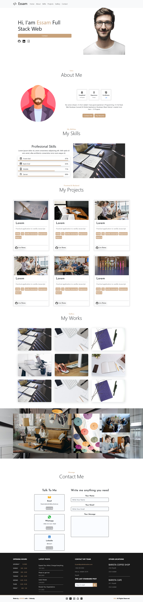
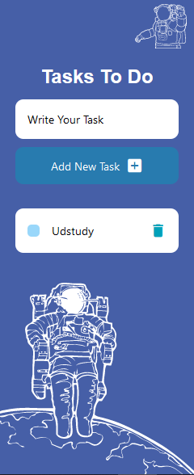

# Week 6 Final Project


## Final Project
 - Section 1
      - [Portfolio](https://github.com/x39OME/Ustudy-Application-Development-Camp/tree/main/Week%206/Final%20Project/1-portfolio-ustudy-final-project)
    ```
      ● Create a Website Using ReactJs (Porfoilo)
    ```
  #### Examples
   ##### [1. Lendex](https://preview.themeforest.net/item/lendex-personal-portfolio-bootstrap-5-template/full_screen_preview/31542002?_ga=2.205443218.365865920.1694975648-423778277.1694975648)
   ##### [2. Comeout](https://comeout.netlify.app/demo/default/)
   ##### [3. Shaq](https://shaq-portfolio.netlify.app/)

## Steps
- npm install
- npm i bootstrap@5.3.2
- npm install react-bootstrap bootstrap
- npm start



    
 - Section 2
      - [React Native App](https://github.com/x39OME/Ustudy-Application-Development-Camp/tree/main/Week%206/Final%20Project/TaskToDo)
    ```
      ● Create a React Native Application
    ```
## Steps
- npm install
- npm start
- npm start -w



    
## Required from the final project

